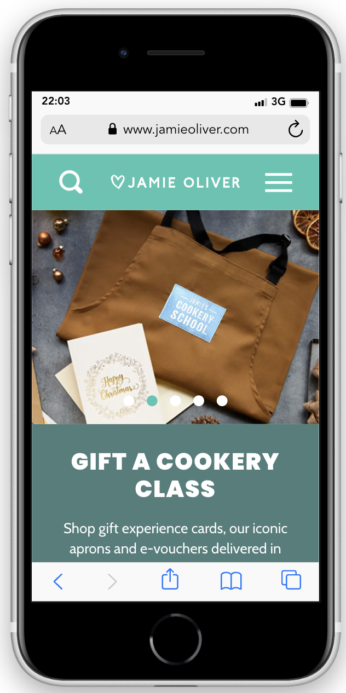
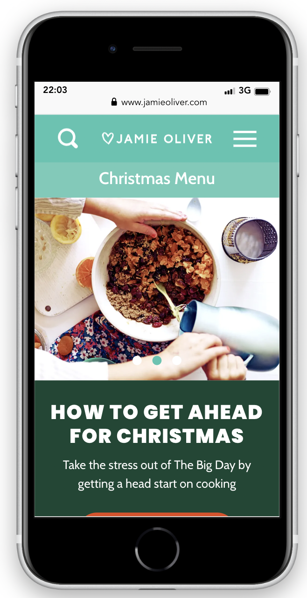
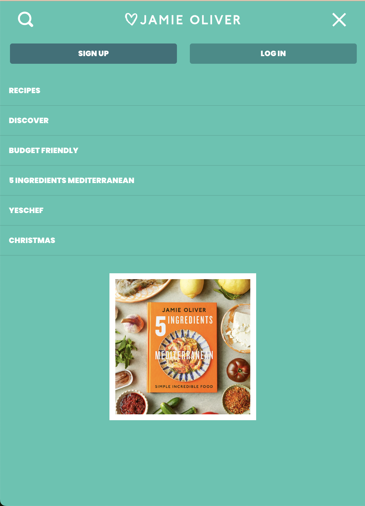

# Procesverslag
Markdown is een simpele manier om HTML te schrijven.  
Markdown cheat cheet: [Hulp bij het schrijven van Markdown](https://github.com/adam-p/markdown-here/wiki/Markdown-Cheatsheet).

Nb. De standaardstructuur en de spartaanse opmaak van de README.md zijn helemaal prima. Het gaat om de inhoud van je procesverslag. Besteedt de tijd voor pracht en praal aan je website.

Nb. Door *open* toe te voegen aan een *details* element kun je deze standaard open zetten. Fijn om dat steeds voor de relevante stuk(ken) te doen.

## Jij

  
uitwerken voor kick-off werkgroep

  ### Auteur:
  Merle van Alen

  #### Je startniveau:
  Blauw

  #### Je focus:
  Responsive
 

## Je website

  
uitwerken voor kick-off werkgroep

  ### Je opdracht:
  https://www.jamieoliver.com/

  #### Screenshot(s) van de eerste pagina (small screen): 
  Homepage  
  

  #### Screenshot(s) van de tweede pagina (small screen):
  Christmas page
  
 

## Toegankelijkheidstest 1/2 (week 1)

  
uitwerken na test in 2e werkgroep

  ### Bevindingen
  Lijst met je bevindingen die in de test naar voren kwamen:

  - De website van Jamie Oliver werkt niet heel goed met de screen reader
  - De Jamie Oliver website was lastig om doorheen te tabben

## Breakdownschets (week 1)

  
uitwerken na afloop 3e werkgroep

  ### de hele pagina: 
  

  ### dynamisch deel (bijv menu): 
  

## Voortgang 1 (week 2)

  
uitwerken voor 1e voortgang

  ### Stand van zaken
  Ik weet niet hoe fontface werkt, de rest gaat wel goed

  ### Agenda voor meeting
  samen met je groepje opstellen

  | Merle      | Ahmadriza          | Quinten    | Niels        |
  | ---            | ---                | ---          | ---              |
  | Hoe kan ik ervoor zorgen dat de carousel iedere keer 1 foto opschuift? | Ik wil weten hoe je een video/annimatie van de inspector kunt halen. Bij mijn site is dat nog ingewikkeld.              | Hoe maak ik dingen klikbaar zonder meer dan 1 html pagina?    | ik wil weten hoe ik de knoppen beter kan centreren en de specifieke vormgeving aan kan passen    |
  | Hoe kan ik op een nette manier fontface gebruiken om nieuwe fonts en font weights toe te voegen? | Hoe de li in de nav zo tonen dat op mobiel formaat het verdwijnt in de dropdown menu en bij desktop wel zichrbaar is | Hoe spreek ik mijn gewenste images aan? Ze zitten allemaal boven een h3 dus mis kan ik daar wat mee. | weten hoe ik de verschillende afbeeldingen een eigen stijl kan geven op een makkelijke manier |
  | ...            | ...               | Marquee, hoe werkt het met screenreader en hoe maak ik drie verschillende berichtjes?         | hoe kan ik de screenreader goed maken             |

  ### Verslag van meeting
  hier na afloop snel de uitkomsten van de meeting vastleggen

  - carousel is gelukt om te maken
  - fontface is gelukt, wel goed opletten of de lettertypes het echt doen of dat ze gedownload zijn

## Voortgang 2 (week 3)

  
uitwerken voor 2e voortgang

  ### Stand van zaken
  Nog wel moeite met flexbox en grid, af en toe doet de code niet wat ik wil

  ### Agenda voor meeting
  samen met je groepje opstellen

  | Merle      | Ahmadriza          | Quinten    | Niels        |
  | ---            | ---                | ---          | ---              |
  | Ik krijg met flexbox en grid mijn ‘li’ niet gecentreerd en op de plek waar ik hem wil, hoe kan ik dit oplossen?  | in m’n 3e section beter grid of flex gebruiken (responsieve)            | Meer duidelijkheid over het inzetten van flexbox op bepaalde elementen   | Hoe ik de horizontale box met text die automatisch beweegt maak    |
  | Wat is een mooie volgorde om mijn css in te schrijven? Sanne liet zien welke volgorde hij gebruikte, en hoe weet ik precies wat er onder welke categorie valt? | ik wil m’n video automatisch laten afspelen | De fonts van sanrio er in krijgen, zijn moeilijk te vinden | Hoe ik de footer apart aanspreek zonder de code al te veel aan te passen. |
| ...            | Mijn nav ook zichtbaar houden tijdens scrollen hiervoor position fixed/absolute?                | De form over de hele breedte te laten spannen          | Wanneer nou button en wanneer een link (precieze verschil)              |  Animatie van scrollen, section van Latest |   en dit  | en dit  | nth of type mag dat steeds?   |

  ### Verslag van meeting
  hier na afloop snel de uitkomsten van de meeting vastleggen

  - Comments toevoegen bij de code

## Toegankelijkheidstest 2/2 (week 4)

  
uitwerken na test in 9e werkgroep

  ### Bevindingen
  Lijst met je bevindingen die in de test naar voren kwamen (geef ook aan wat er verbeterd is):

## Voortgang 3 (week 4)

  
uitwerken voor 3e voortgang

  ### Stand van zaken
 Ik loop er tegen aan dat de sections niet goed scalen. Ben het nu responsive aan het maken, maar ik merk dat dit niet heel goed gaat. 
 In de toekomst ga ik het steeds per section responsive maken en niet als de website klaar is, ik denk dat ik hiermee minder fouten ga maken.

  ### Agenda voor meeting
  samen met je groepje opstellen

  | student 1      | student 2          | student 3    | student 4        |
  | ---            | ---                | ---          | ---              |
  | dit bespreken  | en dit             | en ik dit    | en dan ik dat    |
  | en dat ook nog | dit als er tijd is | nog een punt | dit wil ik zeker |
  | ...            | ...                | ...          | ...              |

  ### Verslag van meeting
  hier na afloop snel de uitkomsten van de meeting vastleggen

  - punt 1
  - punt 2
  - nog een punt
  - ...

## Eindgesprek (week 5)

  
uitwerken voor eindgesprek

  ### Je uitkomst - karakteristiek screenshots:
  

  ### Dit ging goed/Heb ik geleerd: 
  Korte omschrijving met plaatjes

  

  ### Dit was lastig/Is niet gelukt:
  Korte omschrijving met plaatjes

  

## Bronnenlijst

  
continu bijhouden terwijl je werkt

  1. https://codepen.io/shooft/pen/BaMVzOo
  2. ChatGPT, ik heb geen code laten schrijven door AI. Ik heb alleen dingen gevraagd die ik lastig vond om te googlen, met deze bevindingen heb ik zelf geexperimenteerd en mijn code geschreven.

